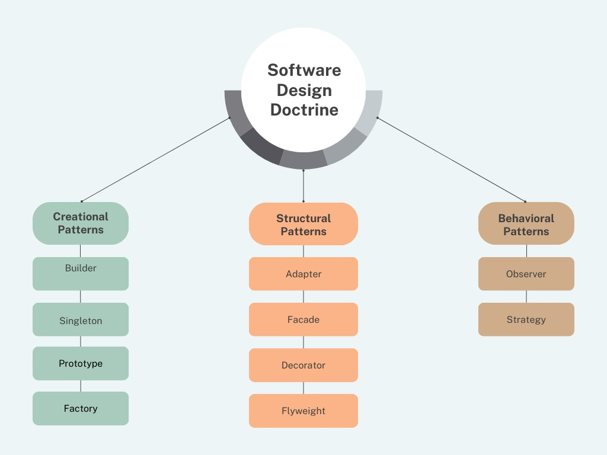

# DesignDoctrine
Design principles are fundamental guidelines and best practices that designers use to enhance the aesthetics, functionality, and usability of a product or project

Design patterns are typical solutions to common problems in software design. They represent best practices used by experienced object-oriented software developers to solve certain problems in a more efficient and elegant way. Design patterns are templates designed to help write code that is easy to understand and maintain.

# Why Design Patterns?
The need for design patterns arises from the desire to achieve code reusability and to solve problems in a standard, tested, and efficient manner. They help:

* **Avoid reinventing the wheel:** Design patterns provide tested and proven development paradigms, saving developers the effort of finding solutions to common problems.
* **Improve code readability:** For developers familiar with the patterns, it's easier to understand the architecture of a program.
* **Enhance code maintainability:** Because design patterns are well-documented and standardized, they make code more adaptable and maintainable.
* **Facilitate communication:** Design patterns provide a common vocabulary for developers, which simplifies communication about software designs and architectures.
* **Solve specific design issues:** Each pattern addresses a specific issue, providing a structured approach to more efficient problem-solving.

# Some Most Useful Design Patterns
Design patterns can be categorized into three main types: Creational, Structural, and Behavioral. Here are some of the most useful patterns from each category:

# Creational Patterns

* [**Builder:**](https://github.com/sidhant97/DesignDoctrine/tree/main/builder) Separates the construction of a complex object from its representation, allowing the same construction process to create various representations. This is especially useful for creating complex objects with numerous initialization parameters.
* [**Singleton:**](https://github.com/sidhant97/DesignDoctrine/tree/main/singleton) Ensures that a class has only one instance and provides a global point of access to it. This is useful in scenarios where multiple objects need to coordinate actions across a system.
* [**Prototype and Registry:**](https://github.com/sidhant97/DesignDoctrine/tree/main/prototype) Prototype design pattern is a creational design pattern that allows creating new objects by copying an existing object, all while keeping the concrete classes hidden from the client.
* [**Factory Method:**](https://github.com/sidhant97/DesignDoctrine/tree/main/factory) Defines an interface for creating an object but lets subclasses alter the type of objects that will be created. It's useful for encapsulating object creation when the exact types of objects may not be known until runtime.

# Structural Patterns
* Adapter (Wrapper): Allows objects with incompatible interfaces to collaborate. It's like a translator between two code interfaces, enabling them to work together without modifying their source code.
* Decorator: Adds new functionality to an object without altering its structure. This pattern is useful for adding responsibilities to objects dynamically and transparently, that is, without affecting other objects.

# Behavioral Patterns
* Observer: Defines a dependency between objects so that when one object changes its state, all its dependents are notified and updated automatically. It's widely used in implementing distributed event handling systems, like the model-view-controller (MVC) architecture.

* Strategy: Defines a family of algorithms, encapsulates each one, and makes them interchangeable. Strategy lets the algorithm vary independently from clients that use it. This is useful when you have multiple algorithms for a specific task and want to switch between them dynamically.

* Command: Encapsulates a request as an object, thereby allowing for parameterization of clients with queues, requests, and operations. It also allows for the support of undoable operations.

Understanding and applying design patterns appropriately can significantly enhance the quality of software in terms of its architecture, maintainability, and scalability. However, it's also crucial not to overuse or misuse them, as that can lead to unnecessarily complex and hard-to-maintain code.