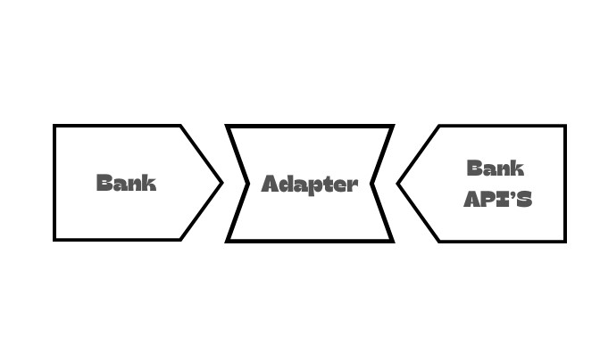

# Adapter Design Pattern

The Adapter Design Pattern is a structural pattern that allows incompatible interfaces to work together. It acts as a bridge between two incompatible interfaces by converting the interface of a class into another interface that a client expects. This pattern involves a single class called an adapter, which is responsible for joining functionalities of independent or incompatible interfaces.

# Intent
* Allow two incompatible interfaces to work together.
* Convert the interface of a class into another interface that a client expects.
* Wrap an existing class with a new interface.

# Implementation
* **Target Interface:** The interface that the client expects.
* **Adaptee:** The existing class that needs to be adapted.
* **Adapter:** A class that implements the target interface and wraps the adaptee.

# Example in Java
Certainly! Let's consider an example where we have an existing system that uses UPI (Unified Payments Interface) for payment services, and we want to adapt it to work with a new Bank type. In this case, we'll create an adapter to bridge the UPI payment service to the new Bank type.

[ **UPI (Unified Payments Interface)**](https://github.com/sidhant97/DesignDoctrine/tree/main/adapter)
  
# Use Cases
* Integrating new components with existing systems.
* Reusing existing classes with incompatible interfaces.
* Implementing a client-independent interface for a third-party library.

# Pros
* Allows the integration of systems with incompatible interfaces.
* Promotes code reusability by allowing the use of existing classes.
* Enables the development of new functionality without modifying existing code.

# Cons
* Can lead to a more complex code structure with the introduction of adapters.
* May impact performance if not implemented efficiently.
# Conclusion
The Adapter Design Pattern is a powerful tool for making existing classes work with new systems without modifying their source code. It facilitates the reuse of existing components and promotes flexibility in system design. When used judiciously, adapters can significantly contribute to the maintainability and extensibility of a software system.