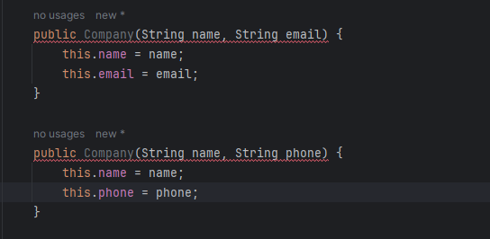

# Builder Design Pattern

# Use Case
Before creating an object, we need to validate the value of attributes and set them. How do we do this?

**Solution 1** :  

Using the setter method is a way to set attribute values and validate them. 

[Java Code with Solution 1](https://github.com/sidhant97/DesignDoctrine/tree/main/builder/src/withoutBuilderV0)

**Problem with Solution 1 :**  Our use case statement is not fulfilled because we create an object before setting an attribute value.

**Solution 2** :

Another way to set attribute values and validate them is by using the constructor.

[Java Code with Solution 2](https://github.com/sidhant97/DesignDoctrine/tree/main/builder/src/withoutBuilderV1)

**Problem with Solution 2 :**  

* The same signature match is causing a compile time error, even though we have passed different arguments.

    

* It's a challenge to manage all the different constructor combinations for different argument.

**Solution 3** : 

By using the Telescope constructor, it is possible to set attribute values and validate them in a sophisticated manner.

# **Our use case statement is not fulfilled , so we can now utilize through using Builder Pattern.**

The Builder Design Pattern is a creational pattern used to construct a complex object step by step. It separates the construction of a complex object from its representation so that the same construction process can create different representations. This pattern is particularly useful when an object needs to be created with many possible configurations, and it's not practical to create constructor overloads for each possible set of parameters.

The Builder Design Pattern can be extended to include object attribute validation before the final creation of the complex object. This ensures that the object is constructed with valid and consistent attributes, providing an additional layer of control over the creation process.
# Intent
* To separate the construction of a complex object from its representation, allowing the same construction process to create various representations.
* To allow an object to be constructed in a step-by-step fashion.
* To encapsulate the construction logic of objects which might require complex assembly.

# Implementation
Implementing the Builder pattern involves creating a Builder class that defines all the steps needed to construct a complex object. A Director class then uses this Builder to execute the steps in a particular sequence to construct the object. The client only needs to instantiate the director and the concrete builder, then instruct the director to construct the object using the builder. This pattern is especially useful when creating an object involves many steps that can be done in different orders or not all steps are required.

# Components
1. Builder: An interface that defines all the steps to build a part of a complex object.
2. Concrete Builder: Implements the builder interface and provides an implementation for the steps defined by the builder. It keeps the product it creates.
3. Product: The complex object that is being built.
4. Director: Directs the building process using the builder interface. It knows which steps to execute to get the desired product. 

# Example in Java
Below is a simplified example of the Builder pattern used to construct a complex Car object.

# Use Cases
* When the algorithm for creating a complex object should be independent of the parts that make up the object and how they're assembled.
* When the construction process must allow different representations for the object that's constructed.
* When you want to isolate complex construction code from the business logic of the object.

# Pros
* Allows for constructing complex objects step-by-step.
* Encapsulates the construction code from the actual product.
* Provides control over the construction process.
* Increases the modularity of the construction code.
# Cons
* Can result in a more complicated design than necessary if the object being constructed isn't actually very complex.
* Requires creating multiple new classes, which can increase the complexity of the code.
# Conclusion
The Builder Design Pattern is a valuable tool for dealing with the construction of objects that may require numerous steps, some of which might need customization or to be optional. By encapsulating the construction logic away from the actual product, it not only simplifies the client code but also provides finer control over the construction process.