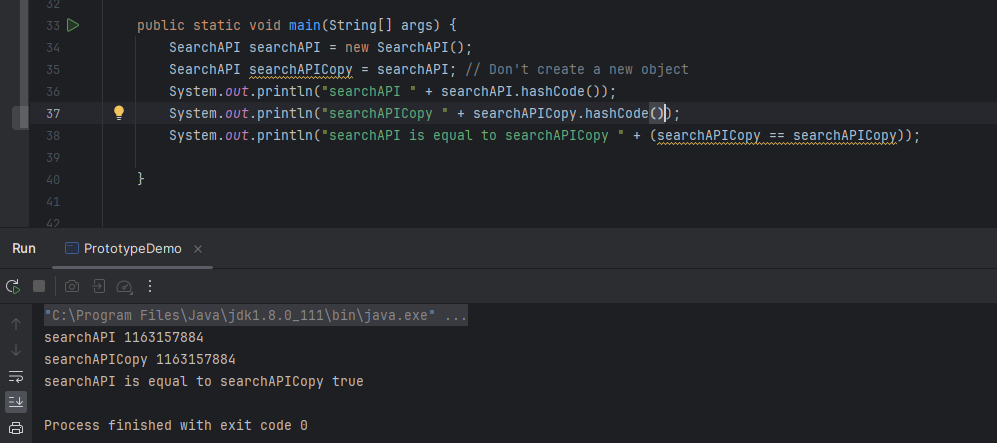
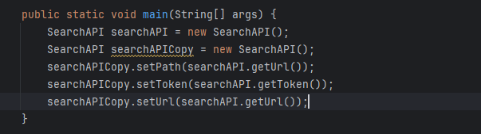

# Prototype Design Pattern and Registry Design Pattern

# Use Case
When given an object from a class, we must generate a duplicate of it.

**Solution 1** :

**Problem with Solution 1 :** Both objects have identical code, which is not in accordance with our use case statement.

**Solution 2** :

**Problem with Solution 2 :**

* **Tightly coupled** implementations necessitate the client's knowledge of all implementations.

* How can we access the attributes that are private within the class?

* To generate an object in the presence of many children in the base class, an **if else-if else** condition must be used, which will result in breaking SRP and OCP.

# **Fulfilling use case statements is achieved by using the Prototype and Registry pattern.**

The Prototype Design Pattern is a creational pattern that allows the creation of new objects by copying an existing object, known as the prototype. This pattern is particularly useful when the cost of creating a new object is more expensive or complex than copying an existing one.

# Intent
* Create new objects by copying an existing object (prototype).
* Avoid the cost of creating a new instance from scratch by copying an existing instance.

# Implementation
* **Prototype Interface:** Declare an interface with a method to clone the object.
* **Concrete Prototype:** Implement the clone method defined in the prototype interface.
* **Client:** Creates new objects by copying the prototype.

# Use Cases
* When the cost of creating a new object is more expensive than copying an existing one.
* When objects have similar properties, and variations can be achieved by modifying some properties.
* When a class cannot anticipate the class of objects it must create.

# Pros
* Efficient creation of new objects by copying existing ones.
* Reduces the complexity of creating complex objects.
* Can be used to implement a generic factory.

# Cons
* Cloning complex objects might be challenging, especially when dealing with deep copy issues.
* Requires careful implementation of the clone method.

# Registry Design Pattern
The Registry Design Pattern, also known as the Registry or Registry Singleton pattern, is a creational pattern that provides a centralized point for managing and storing instances of classes, often referred to as objects or services. The registry acts as a global store for shared instances and facilitates easy access to them.

# Intent
* Provide a centralized registry for storing and accessing instances of classes.
* Allow objects to be shared and reused throughout an application.

#Use Cases
* Managing and sharing instances of services or components.
* Implementing a service locator where instances are centralized for easy access.
* Centralized configuration management.

# Pros
* Centralized management of instances promotes reusability.
* Facilitates easy access and sharing of objects.
* Simplifies the process of managing and configuring services.
* 
# Cons
* Can lead to global state issues if not used carefully.
* Increases the dependency of clients on the registry, potentially affecting testability.
* May introduce a level of indirection that could complicate code understanding.

# Example in Java
Below is a simplified example of the Builder pattern used to construct a complex SearchAPI object. 

[**SearchAPI Prototype and Registry patterns Example**](https://github.com/sidhant97/DesignDoctrine/tree/main/prototype)

Both the Prototype and Registry patterns serve different purposes, with the Prototype pattern focusing on efficient object creation, and the Registry pattern focusing on centralized management and access of instances. Depending on the specific requirements of your application, you may choose to use one or both patterns.